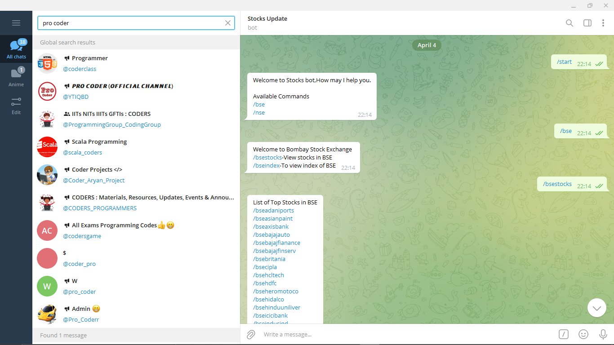
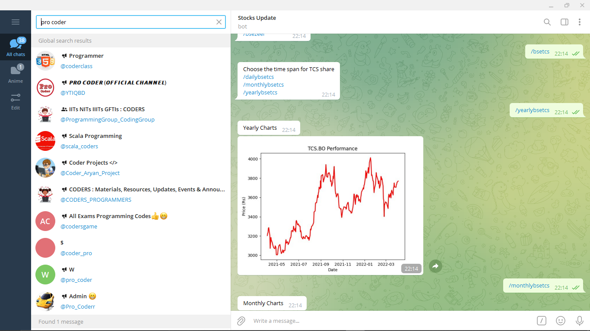

# Stock_Telegram_Bot
 
## Features
   - It will give bot interface for stocks update.
   - Receive daily updated charts for different stocks listed in both NSE and BSE
   - Give update of daily ,monthly and yearly stocks of companies. 

## How to use it ??
-Enter your bot's API id in the space mention to  get response in your device. 
-Open the bot and run as mention in screenshot . 

## Screenshots
- How to run in your telegram 

-chart display

